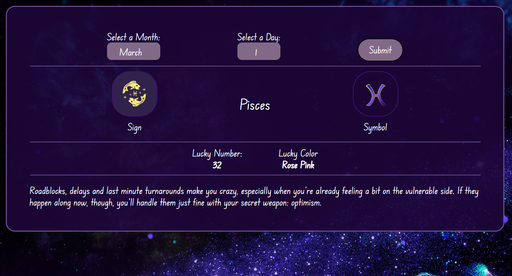

# Horoscope 

<h3>
The horoscope application allows the user to know his prophecy. By choosing the month and day of birth, the user will receive a horoscope for the current day, which will contain information about the zodiac sign (name, symbol and sign), lucky number and lucky color, and a short prophecy.

  

The application was written in JavaScript using API.
The API used in the application comes from Aztro by Sameer Kumar.
<i> (link to API: https://rapidapi.com/sameer.kumar/api/aztro) </i>

</h3>

